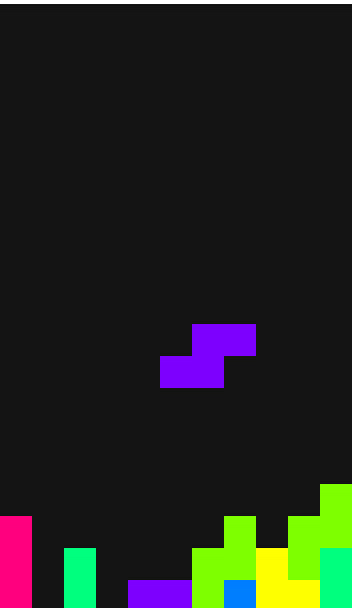

# Falling Blocks

## About
This project is a simple game where the player combines falling blocks to create contiguous rows. As rows are completed, they disappear, and the player’s score increases.
The game ends when a new block cannot be placed without colliding with existing blocks at the top of the grid.

## Built With
**Python**: Core language for game logic and functionality.
**Pygame**: Library for handling game graphics, user input, and display management.
**Math**: Used for calculating rotations and handling block positioning.
**Random**: To introduce variation in block shapes and colors for added game complexity.

## Game Commands

- **Arrow Left**: Move the block left.
- **Arrow Right**: Move the block right.
- **Arrow Down**: Move the block down faster.
- **Arrow Up** / **Q**: Rotate the block counterclockwise.
- **E**: Rotate the block clockwise.

## License
This source code is licensed under the BSD-style license found in the LICENSE file in the root directory of this source tree.